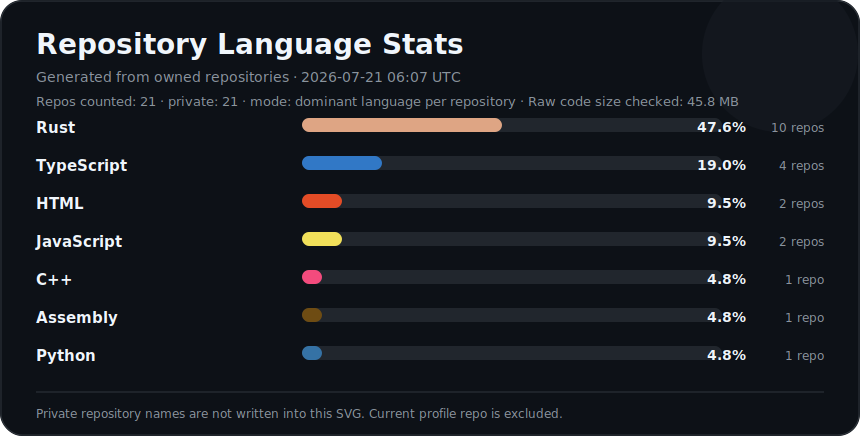

<h1 align="center">backend engineer</h1>

  <b>Rust · Backend · Industrial Systems · IIoT</b>

  edge platforms · protocol integrations · production infrastructure

---

## About

Backend engineer focused on Rust, industrial systems, IIoT platforms, and production-grade infrastructure.

I work with systems where reliability, maintainability, and predictable execution matter: backend services, edge environments, protocol-heavy integrations, internal tools, and codebases that need to be stabilized instead of endlessly patched.

Most work may live in private repositories, but the direction stays public: clean systems, reliable services, and steady engineering progress.

---

## Stack

  
  
  
  
  
  

---

## Industrial / Systems

  
  
  
  
  

  
  
  
  

---

## Language Stats

  

---

## Engineering Focus

- Rust backend services
- industrial backend systems
- IIoT and edge platforms
- protocol-heavy integrations
- production codebase recovery
- Linux-based deployment and tooling
- Dockerized infrastructure
- internal automation tools

---

## Principles

- reliability over noise
- clarity over cleverness
- ownership over excuses
- simple systems over accidental complexity
- stable behavior over pretty abstractions

---

  <b>Rust · Backend · Industrial Systems</b>

  <i>private work, real engineering, public progress.</i>

